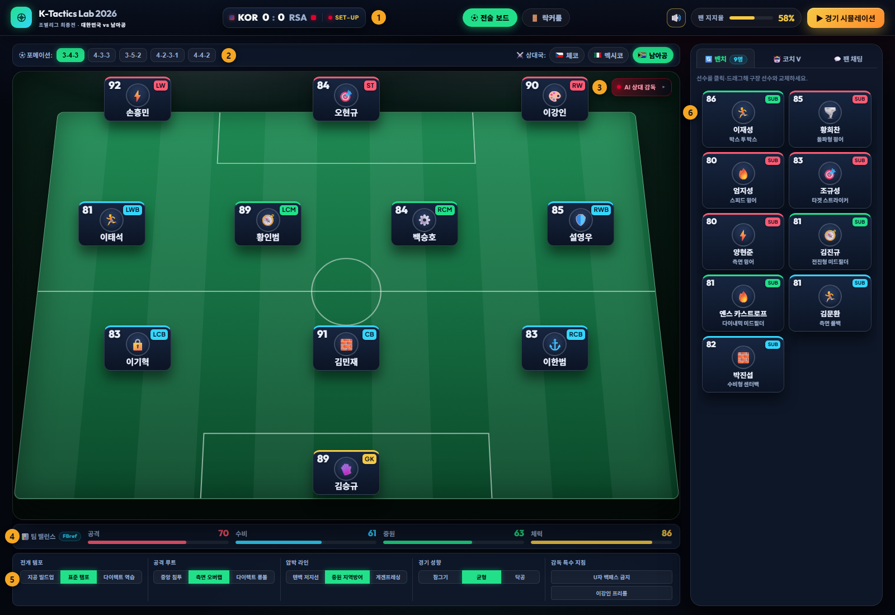
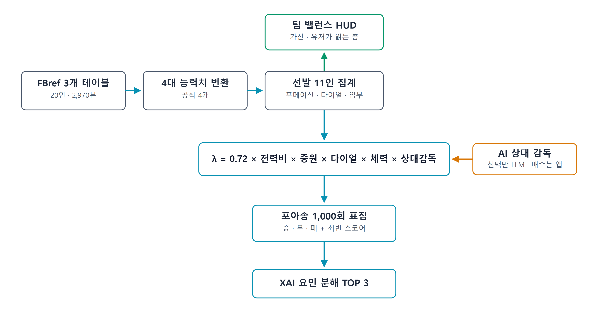
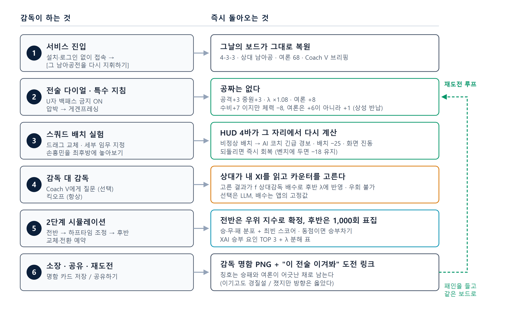

# [월간 해커톤: 내가 축구 감독이라면 - 월드컵 전술 웹서비스 챌린지] 기획서

**서비스명: K-Tactics Lab 2026**
**부제: 2026 월드컵 대한민국 국가대표팀 전술 솔루션 및 인터랙티브 감독 시뮬레이터**
**공식 라이브 데모 URL (Live Demo):** https://k-tactics-lab-2026.vercel.app
**권장 환경:** 데스크톱 Chrome 브라우저, 가로 1280px 이상

---

## 1. 서비스 개요

### 1.1 기획 배경 및 문제 정의 (언론 및 전술 분석 데이터 기반)

2026 북중미 월드컵 본선에서 대한민국은 조별리그 남아공전 0-1 패배로 조 3위에 그쳤습니다. 국내 언론이 반복해서 지적한 전술적 쟁점은 세 가지입니다.

1. **U자형 빌드업과 전술 경직성:** 공격 전개가 센터백과 풀백 사이 횡패스에 갇히는 문제는 홍명보 감독 본인이 부임 워크숍에서 먼저 꺼낸 주제였습니다. "상대를 몰아놓고 공격하게 되면 우리가 U자형 플레이를 하게 된다"며 약팀에 역습으로 지는 원인으로 짚었지만, 부임 첫 경기 팔레스타인전(0-0)에서 매체는 "U자 빌드업의 형태가 자주 나왔다"고 적었습니다 ([Interfootball, 2024](https://sports.news.nate.com/view/20240905n41102)). 이후 본선까지도 직전 10경기 중 9경기가 같은 스리백이었고, 남아공전에서는 뒤진 상황에서도 공격 전환에 실패했습니다 ([MBC, 2026a](https://imnews.imbc.com/replay/2026/nwdesk/article/6833724_37004.html)). 감독 스스로 "왜 이런 경기력이 나왔는지 당황스럽다"며 원인을 특정하지 못했습니다 ([Hankook Ilbo, 2026](https://www.hankookilbo.com/news/article/A2026062608010004313)).
2. **스리백 측면의 뒷공간:** 윙백이 공격에 가담한 뒤 열리는 뒷공간이 반복 공략됐습니다. 본선 직전 코트디부아르와의 평가전에서 0-4로 무너졌고, 본선에서도 남아공전에서 슈팅 8대 13으로 밀리다 후반 18분 마세코에게 결승골을 허용했습니다 ([Financial News, 2026a](https://www.fnnews.com/news/202606251312188929)).
3. **스타 개인 기량 의존:** 플랜 B 없이 손흥민 등 스타의 기량에 기대는 운영을 두고 팬들 사이에서 '해줘 축구'라는 말이 나왔습니다. 탈락 기로의 최종전에서 손흥민을 벤치에 앉히는 변칙 승부수를 던졌지만 ([Financial News, 2026b](https://www.fnnews.com/news/202606251055226408)), 후반 교체 카드는 듣지 않았고 선발 원톱 오현규는 고립됐습니다. 스타를 뺀 자리에 남는 공격 방식이 없다는 사실이 그 경기에서 드러난 셈입니다 ([Korea Daily, 2026](https://www.koreadaily.com/article/20260625003112534); [MBC, 2026b](https://imnews.imbc.com/news/2026/sports/article/6832790_36946.html); [Kyeonggi Ilbo, 2026](https://www.kyeonggi.com/article/20260626580030)).

이 쟁점을 두고 대중이 실제로 해볼 수 있는 것은 많지 않았습니다. 반대편의 Football Manager는 시즌 운영 도구라 '그 경기의 그 장면'만 다시 지휘하려는 사람과는 목적이 다릅니다. 본 서비스는 스쿼드 보드는 열어 두되 **전술 지시는 4대 다이얼 × 3안과 특수 지침 토글 2종** 으로 좁혔고, 저장 파일도 시즌 진행도 없이 단 한 경기만 다룹니다. 대신 모든 선택이 바꾸는 즉시 팀 지표와 여론 수치로 되돌아옵니다. 학습 곡선이 있어야 할 자리를 **즉각적인 인과 피드백** 으로 대체한 것이 본 서비스의 접근입니다.

### 1.2 서비스 정의

**K-Tactics Lab 2026** 은 2026 월드컵 조별리그 남아공전(0-1 패)을 사용자가 직접 다시 지휘하는 **한 경기 전술 지휘 시뮬레이터**입니다. 감독석에 앉아 위 3대 쟁점을 자신의 방식으로 풀어 보는 것이 목표이며, 진입 시 남아공전 재지휘 대신 **자유 모드**를 골라 같은 조에서 만난 체코·멕시코를 상대로 같은 판을 시험할 수도 있습니다. 포메이션과 2026 월드컵 공식 출전 20인(구장 11명 + 벤치 9명)을 자유롭게 배치하고, 4대 전술 다이얼과 감독 특수 지침으로 국면마다 결단합니다. 경기 결과와 대중 여론 지지도(Vibe Meter)는 끝까지 별개의 성적표로 남습니다.

### 1.3 서비스의 독창성 및 차별점

축구 시뮬레이션도, 전술 투표나 팬 설문도 이미 많습니다. 본 서비스가 그것들과 갈라지는 지점은 세 가지이며, 모두 화면에서 곧바로 확인되는 형태로 구현했습니다.

1. **상대가 이쪽을 스카우팅하는 적대적 루프 (Manager vs AI Manager):** 전술 시뮬레이터에서 상대는 보통 고정된 난이도 값입니다. 본 서비스의 **AI 상대 감독** 은 킥오프마다 사용자의 XI와 다이얼을 읽고 카운터 전술을 구조화 JSON으로 결정한 뒤, 실제 확률 연산(5.3의 $f_{\text{상대감독}}$ 배수)에 반영합니다. 내 판을 바꾸면 상대의 대응도 바뀌므로, 마주하는 것은 난이도 슬라이더가 아니라 **판단하는 상대 감독** 입니다. 수석 코치 **Coach V** 도 같은 레이어 위에 있고, 네트워크나 무료 한도 실패 시 스크립트 폴백으로 무중단 동작합니다.
2. **결과가 아니라 이유를 돌려주는 시뮬레이션 (Explainable Simulation):** 승/무/패 확률만 던지는 블랙박스가 아닙니다. 결과 카드는 **'승부 요인 TOP 3'** 를 해설위원식 문장과 기대 득점 기여치로 노출하고(예: "게겐프레싱이 상대 빌드업을 질식시켰다 (+0.10골)"), 접이식 **'λ 분해'** 표가 기본 전력부터 최종 λ까지 전 체인을 공개합니다. 다음 판에 무엇을 바꿔야 하는지를 감이 아니라 숫자로 알게 됩니다. 이 분해가 승패 연산과 정확히 일치한다는 것은 5.4에 수식으로 밝혔습니다.
3. **승패와 분리된 여론 축 (Dynamic Vibe Meter):** 감독을 실제로 누르는 것은 결과만이 아니라 여론입니다. 대중 지지율을 승패와 **완전히 독립된 2차 지표** 로 설계해, 이기고도 비판받고 지고도 박수받는 상황이 성립합니다. 텐백은 상대 기대 득점을 25% 깎아주면서 지지율 −12를 부르고, 손흥민을 벤치에 앉히면 −18이 붙습니다. 개혁적인 선택은 승률과 지지를 함께 얻지만, 실리를 택하는 순간 둘이 갈라집니다. 같은 전술도 상대가 바뀌면 평가가 뒤집힙니다(멕시코 상대 게겐프레싱 −10). 이 갈라짐이 곧 감독석의 감각입니다.

이 세 가지 위에 기본기를 갖췄습니다. 포메이션 실시간 전환과 20인 구장·벤치 자유 교체, 포지션별 세부 임무(Role) 지정을 지원하는 샌드박스, 마우스 드래그 앤 드롭과 클릭 맞교환(Click-to-Swap)의 이중 조작 체계, 그리고 결과 명함 PNG 추출과 '도전 링크(URL 인코딩)' 공유입니다.

---

## 2. "감독 경험" 설계 의도

### 2.1 설계 원칙: 개입 지점을 둘로 좁힌다

목표는 **"전술적 선택과 스쿼드 배치가 팀 밸런스와 대중 여론에 어떤 상충을 만드는가"** 를 감독석에서 겪게 하는 것입니다. 그래서 경기를 분 단위로 쪼개지 않았습니다. 감독이 개입하는 지점은 **킥오프 전 한 번, 하프타임 한 번** 뿐입니다. 결정이 잘게 흩어지면 무엇이 승부를 갈랐는지 알 수 없고, 되돌리고 싶은 지점도 특정되지 않기 때문입니다. 아래 3대 국면은 그 두 순간에 무엇을 결정할 수 있는지를 나눈 것입니다.

### 2.2 3대 경기 국면별 전술 지휘 체험

사용자는 전술판 위에서 언론 보도를 통해 도출된 대표팀의 핵심 전술 쟁점을 3대 경기 국면으로 나누어, **4대 전술 다이얼(전개 템포·공격 루트·압박 라인·경기 성향), 감독 특수 지침 토글 2종, 하프타임 교체 예약** 으로 지휘합니다.

1. **국면 ①: 공격 전개 및 빌드업 지침 (U자형 빌드업 타파)**
   - **설계 의도:** '공격 루트' 다이얼(하프스페이스 중앙 침투 / 측면 오버랩 / 다이렉트 롱볼)로 공격 경로를 정하고, 별도의 **'감독 특수 지침' 토글 2종(🚫 U자 백패스 금지, 🎯 이강인 프리롤)** 으로 시그니처 개혁을 켜고 끕니다. 백패스 금지와 하프스페이스 침투는 공격 지표와 여론을 함께 올리지만, 이강인 프리롤은 화력과 뒷공간 리스크를 같이 얻습니다. '전개 템포'(지공 빌드업 / 표준 / 다이렉트 역습)로 공격 전개 속도까지 함께 조율합니다.
2. **국면 ②: 측면 수비 및 경기 운영 밸런스 (윙백 뒷공간 차단)**
   - **설계 의도:** '압박 라인'(텐백 저지선 / 중원 지역방어 / 게겐프레싱)와 '경기 성향'(잠그기 / 균형 / 닥공) 다이얼로 수비 안정과 위험 감수의 상충을 조율합니다. 게겐프레싱은 수비 +7과 여론 +6을 얻는 대신 체력 −8을 치르고, 텐백은 상대 기대 득점을 25% 깎는 대신 공격 −8과 여론 −12를 함께 치릅니다. 어느 쪽도 한쪽만 움직이지 않습니다.
3. **국면 ③: 후반 플랜 B 및 위기관리 (스타 개인 기량 의존 탈피)**
   - **설계 의도:** 전반이 끝나야 열리는 국면입니다. 방전된 선수를 눈으로 확인한 뒤에야 **[⏱️ 60분 조커 투입]** 과 **[⏱️ 75분 닥공 전환]** 을 예약할 수 있고, 예약한 교체는 후반 평균 체력을 실제로 끌어올려 기대 득점에 반영됩니다(§4.4). 표기된 분(分)은 중계 연출이며 후반은 한 번에 표집합니다. 스타 한 명의 기량에 기대는 대신 플랜 B를 미리 설계해 두는 자리이고, **경기 중** 교체가 열리는 국면은 여기뿐입니다.

---

## 3. 페이지 구성 및 UI 레이아웃

전술 설정·피드백·시뮬레이션을 한 화면에 모은 **'매치데이 브로드캐스트 보드'** 단일 레이아웃입니다. 중계 화면의 문법(스코어버그, 선수 카드)을 빌려 **경기장을 화면의 주인공**으로 두고, 보조 정보는 우측 3탭 패널과 접이식 칩으로 밀어냈습니다.

▲ 실제 구현 화면. 번호는 아래 3.1의 여섯 영역에 대응합니다: **① 상단 헤더 ② 매치 컨트롤 바 ③ AI 상대 감독 칩 ④ 팀 밸런스 HUD ⑤ 전술 덱 ⑥ 우측 3탭 패널**

### 3.1 영역별 구성 명세

1. **상단 헤더:** [전술 보드]/[락커룸] 전환 탭, **KOR 대 상대국 스코어버그**, 팬 지지율 바, 사운드 토글, 그리고 국면에 따라 라벨이 바뀌는 CTA **[▶ 경기 시뮬레이션] → [🔥 후반전 승부수 가동] → [🔄 다시 처음부터]** 를 한 줄에 담았습니다. 스코어버그는 `0:0 SET-UP → 1H LIVE → HALF-TIME 45' → 2H LIVE → FULL-TIME 90'` 로 진행을 따라갑니다.
2. **중앙 매치데이 스테이지 (Center Stage):**
   - **매치 컨트롤 바:** 포메이션(3-4-3, 4-3-3, 3-5-2, 4-2-3-1, 4-4-2) 즉시 전환과 상대국 선택. 3개국은 실제 2026 본선 조별리그에서 만난 **체코(2-1 승)·멕시코(0-1 패)·남아공(0-1 패)** 그대로입니다. 남아공전은 3-4-3이었으므로(FBref 경기 기록) 보드도 3-4-3으로 열리며, 그 대형을 그대로 다듬거나 포백으로 옮겨 구조 자체를 갈아엎는 선택이 모두 가능합니다.
   - **피치:** 선발 11인의 **선수 카드**(FBref 레이팅, 포지션 컬러, 체력 게이지)가 포메이션 대형 그대로 놓이고, 드래그와 클릭 양쪽으로 교체됩니다.
   - **AI 상대 감독 칩:** 스카우팅 브리핑과 경기 진행 상태를 중계하고, 하프타임에는 교체 예약 버튼을 담습니다.
   - **팀 밸런스 HUD:** 공격·수비·중원·체력 4대 속성을 피치 바로 아래 막대 4개로 상시 노출합니다 (FBref 기반 0~100).
   - **전술 덱:** 4대 다이얼과 **감독 특수 지침 토글 2종**(U자 백패스 금지, 이강인 프리롤)을 탭 뒤에 숨기지 않고 가로 덱으로 노출했습니다. 전술을 바꾼 손이 그대로 HUD와 지지율이 움직이는 것을 보게 하려는 배치입니다.
3. **우측 3탭 패널 (벤치 / Coach V / 팬 채팅):** 동시에 볼 일이 없는 세 위젯이라 같은 자리에 겹쳐 두고 탭으로 전환합니다.
   - **[🔄 벤치] (기본 탭):** 교체 대기 9인의 카드 그리드. 구장 카드와 같은 방식으로 교체합니다.
   - **[🤖 코치 V]:** 실제 LLM이 현재 보드를 근거로 조언하는 수석 코치 채팅. 자유 질문과 프리셋 버튼 2종을 제공하며, 오프라인이거나 네트워크 실패 시 스크립트 폴백으로 무중단 응답합니다.
   - **[💬 팬 채팅]:** 현재 보드 상태에 매칭된 대중 반응 댓글이 자동 스크롤되는 여론 중계창.
4. **선수단 락커룸 뷰 (Locker Room):** 2026 월드컵 공식 출전 20인의 카드를 조회하고, 클릭하면 FBref 기반 스카우팅 리포트가 열립니다.
5. **오버레이 모달 (Modals):**
   - **남아공전 히어로 온보딩 모달:** 최초 진입 시 그날의 상황을 제시하고 재지휘 시나리오를 시작합니다. 체코전 승리 뒤 멕시코·남아공전을 내리 0-1로 지면서 승점 3, 조 3위로 끝난 대회였고, 남아공전을 비기기만 했다면 승점 4로 32강이 열려 있었습니다.
   - 시뮬레이션 모달: **2D 라이브 중계**(탑뷰 캔버스로 후반 45분을 재생, 중계 문구와 스코어버그가 같은 시계로 갱신) → 동점이면 **키커 시점 승부차기 뷰** → 감독 명함 결과 카드. 두 애니메이션은 모두 이미 확정된 결과를 보여주는 표현 계층이라 확률을 움직이지 않습니다. 결과 카드에는 **XAI '승부 요인 TOP 3'와 접이식 'λ 분해 상세 표'** 가 포함됩니다 (§5.4).

---

## 4. 핵심 인터랙션 명세

### 4.1 인터랙션 A: 이원화 스쿼드 배치 및 교체

- **두 갈래 입력, 같은 결과:** 드래그 앤 드롭(HTML5 Drag & Drop API)과 클릭 맞교환(Click-to-Swap)이 동일한 교체 로직 위에 얹혀 있습니다. 클릭 경로는 트랙패드처럼 드래그가 번거로운 장치를 위한 보조이자, 드래그가 중간에 끊겨도 교체가 막히지 않게 하는 안전장치입니다.
- **두 경로는 화면에서 구분됩니다.** 드래그 중인 카드와 클릭으로 고른 카드가 서로 반대로 표시되어, 지금 어느 방식으로 조작 중인지 보입니다.

### 4.2 인터랙션 B: 비정상 배치 감지 및 AI 코치 경고

- **판정:** 배치된 선수의 포지션 속성과 슬롯을 비교합니다. 공격 자원이 최후방·골문에 놓이거나 골키퍼가 최전방에 놓이면 걸립니다.
- **반응:** AI 코치 긴급 경보가 뜨고 여론 지지율이 즉시 깎입니다. 공격 자원을 최후방·골문에 두면 **−25**, 골키퍼를 최전방에 두면 **−30** 이며 두 판정은 별개라, 공격수와 골키퍼를 맞바꾸면 한 번에 **−55** 가 붙습니다. 40% 미만으로 떨어지면 붉은 경고 상태로 전환되고 중계창에 비판 댓글이 올라옵니다.
- **누적되지 않습니다.** 현재 배치를 볼 때마다 다시 계산하므로 제자리로 되돌리면 그 자리에서 회복됩니다. 판정 기준이 이름이 아니라 포지션 속성이라, 손흥민이 아닌 어느 공격 자원을 내려도 똑같이 걸립니다.

### 4.3 인터랙션 C: 클릭 기반 선수 세부 임무 설정

- **동작:** 카드를 한 번 클릭하면 맞교환 대상이 되고, 한 번 더 클릭하면 임무 모달이 열립니다. 카드 하나에 두 기능을 겹쳐 두어 별도의 설정 버튼이 없습니다. 포지션 대분류에 맞는 3~5개 임무(인사이드 포워드, 딥라잉 플레이메이커, 커버링 센터백 등)가 FBref 능력치와 함께 제시됩니다.
- **모든 임무가 상충입니다.** 좌측 풀백 이태석을 '인버티드 풀백'에서 '오버래핑 가담'으로 바꾸면 **공격 +2, 수비 −1, 중원 −2**. 전원을 공격 임무로 도배해도 공격은 최대 +10에 그치는 대신 수비 −8, 중원 −7을 지불합니다. 무한정 강해지는 경로는 없습니다(계산식 §5.2).

### 4.4 인터랙션 D: 2-Phase 턴제 시뮬레이션

| 구간 | 확정되는 것 | 판정 근거 |
| :-- | :-- | :-- |
| 전반 0~45' | 전반 스코어 (무작위 없음) | 공격 우위 ≥ 1.10 이면 만회골, 수비 우위 ≥ 1.05 이면 실점 차단 (§5.3) |
| 하프타임 45' | 교체·다이얼 재조정 | 60분 조커 투입, 75분 닥공 전환. 후반 45분 전체에 반영 |
| 후반 45~90' | 승/무/패 분포 + 최빈 스코어 | λ 다섯 항의 곱 → Poisson 1,000회 표집 |
| PK (동점 시) | 승자 | 기준선 75% ± 침착성·상대 공격력. 5명 뒤 동점이면 서든데스 |
| 결과 카드 | 감독 칭호 + 승부 요인 TOP 3 | 승·패·PK승·PK패 4분기에 여론이 한 겹 더 |

표에 담기지 않는 설계 의도가 넷 있습니다.

- **하프타임은 정보를 받는 자리입니다.** 전반이 끝나면 Coach V가 두 우위 지수를 **실제 수치로** 보고합니다. 무엇이 기준선에 모자랐는지 보고 후반을 고치라는 구간이지, 그냥 넘어가는 화면이 아닙니다. 그보다 앞서 킥오프 시점에는 **AI 상대 감독** 이 우리 XI를 스카우팅해 고른 카운터가 통보되므로, 하프타임에는 상대의 수를 이미 알고 들어갑니다.
- **키커 명단은 전술판이 정합니다.** PK 후보는 **가장 전방에 놓인 7개 슬롯** 이라, 누구를 앞세울지 정한 배치가 그대로 키커 풀이 됩니다. 이 중 5인의 순서만 직접 지정합니다.
- **칭호는 어긋난 채로 남습니다.** **이기고도 지지율이 40 미만이면 "이기고도 경질설 — 여론을 잃은 승장", 지고도 70 이상이면 "졌지만 방향은 옳았다 — 지지받는 패장"** 이 됩니다. 승패와 여론이 갈린 경기는 명함에서도 갈린 채로 남습니다.
- **끝나도 판은 남습니다.** **[명함 카드 저장]** 은 2배 해상도 PNG로 뽑고, **[공유하기]** 는 현재 전술을 URL로 인코딩한 **"이 전술 이겨봐" 도전 링크** 를 함께 보냅니다. **[🔄 다시 처음부터]** 는 체력과 스카우팅만 초기화하고 전술 세팅은 유지하므로, 한 군데만 고쳐 다시 돌릴 수 있습니다.

---

## 5. 데이터 활용 방식 및 알고리즘

본 서비스의 데이터는 **"승패를 만드는 수치는 전부 앱 안에 고정하고, 판단만 LLM에 맡긴다"** 는 역할 분리 원칙 위에 설계되었습니다. 결과는 예측 AI가 아니라 FBref 스탯에서 유도한 규칙 기반 확률 모델(로컬 Poisson 몬테카를로)이 산출하고, LLM은 Coach V의 조언과 AI 상대 감독의 전술 선택을 맡습니다.

상대 감독의 선택은 실제로 승패에 영향을 줍니다. 다만 LLM이 할 수 있는 일은 정해진 선택지 중 하나를 고르는 것까지이며, 그 선택이 기대 득점을 몇 배로 바꾸는지는 앱에 적힌 고정값이 정합니다(5.3의 배수표, 5.7의 enum 검증). LLM이 규격 밖의 값을 반환하면 아예 반영되지 않으므로, 모델의 출력 품질이 나빠져도 승패 연산이 흔들릴 여지는 없습니다.

▲ 이 절 전체의 지도입니다. FBref 원천 기록이 능력치로, 능력치가 화면과 확률로 갈라지는 경로를 보여줍니다. 읽을 때 두 가지만 보시면 됩니다. **초록 가지와 파란 줄기가 갈라지는 지점**이 5.2에서 설명하는 두 층의 분리이고(위는 감독이 읽는 가산 층, 아래는 승패를 정하는 곱셈 층), **주황 상자가 하나뿐이라는 것**이 LLM이 개입하는 자리가 전체에서 한 군데임을 뜻합니다.

### 5.1 FBref 원천 지표 → 4대 능력치 변환식

2026 월드컵 본선에 실제 출전한 20인의 FBref 경기 기록(Standard / Shooting / Misc)을 오프라인 스크립트(`scripts/parse_stats.py`)로 파싱하여, 포지션 기준선(Base)에 per-90 지표를 가산하는 방식으로 4대 능력치를 산출합니다. 출전 시간이 짧은 선수는 가중치 `w = min(1, 90s / k)`(공격·중원 k=2, 수비 k=1.5, `90s` 는 FBref의 90분 환산 출전)로 지표 영향을 감쇠시켜, 31분만 뛴 선수의 슈팅 빈도가 풀타임 선수와 동급으로 취급되는 소표본 왜곡을 막습니다. 수집 스코프의 완전성은 출전 시간 합산 검산(20인 합 2,970분 = 3경기 × 11명 × 90분)으로, 산출물의 재현성은 스크립트 재실행 시 커밋 데이터와의 diff-zero로 각각 검증했습니다.

- **공격 파괴력(Attack):** `ATK_Base(pos) + min(10, Sh/90×2.5)·w + min(6, SoT/90×4)·w + Gls×5 + Ast×3` (범위 30~95). _xG가 아니라 유효슈팅·슈팅 빈도·득점 기여 기반입니다._
- **측면 수비 안정도(Defense):** `DEF_Base(pos) + min(12, Int/90×5)·w + min(8, Tkl/90×4)·w − min(4, max(0, Fls/90−2))·w` (범위 30~96). 골키퍼는 `82 + (Save% − 70)×0.3` 로 별도 산정.
- **중원 장악·탈압박(Midfield):** `MID_Base(pos) + min(12, Crs/90×3)·w + Ast×4 + min(5, Fld) + Gls×2` (범위 30~96).
- **후반 체력 유지력(Stamina):** `85 − max(0, Age−27)×0.6 + min(3, max(0, 25−Age)×0.4) + STAM_Adj(pos)` (범위 70~93).

**감쇠 가중치가 왜 필요한지는 조규성 한 명으로 드러납니다.** 2경기 31분을 뛰고 슈팅 5.81회/90분, 팀 전체 최고 수치입니다. 감쇠를 빼면 공격 **88**이 되어 169분을 뛴 손흥민(**83**)을 앞지릅니다. 가중치 `w = 0.15`를 걸어 **74**로 내린 것은, 31분짜리 표본이 순위를 뒤집는 것을 막기 위해서입니다.

**20인 80개 능력치 중 수동 보정은 김민재의 수비 한 곳뿐입니다.** 공식대로면 81인데 **90** 으로 올렸습니다. 인터셉트·태클을 세는 지표는 상대가 아예 그쪽을 피해 간 경우를 낮은 수비력으로 읽기 때문입니다. 보정은 `scripts/parse_stats.py` 의 `override_def` 한 줄로 남아 있어 어느 값이 손을 탔는지 추적되며, 나머지 79개는 전부 공식 산출값입니다.

### 5.2 실시간 팀 밸런스 스탯 연산

**감독이 무언가를 건드리면 피치 아래 막대 4개가 즉시 움직입니다.** 이 막대가 서비스의 성적표이고, 아래 식은 그 막대가 어떻게 정해지는지를 그대로 적은 것입니다. 선발 11인의 평균 능력치에 포메이션 성향, 4대 전술 다이얼, 선수별 세부 임무를 더한 뒤 30~100으로 자릅니다.

$$\text{Stat}_{\text{type}} = \text{clip}\Big(\overline{\text{XI}}_{\text{type}} + \Delta\text{Formation}_{\text{type}} + \sum \Delta\text{Dial}_{\text{type}} + \tfrac{1}{2}\Delta\text{Role}_{\text{type}},\ 30,\ 100\Big)$$

**실리를 택하는 선택에는 공짜가 없습니다.** 하나를 올리면 반드시 다른 하나가 내려갑니다. 상충이 걸린 선택은 다이얼과 특수 지침을 통틀어 아홉 개이고, 아래가 그 전부입니다.

| 선택 | 얻는 것 | 잃는 것 |
| :-- | :-- | :-- |
| 텐백 저지선 | 수비 +10 | 공격 −8 |
| 수비 잠그기 | 수비 +9 | 공격 −7 |
| 전원 닥공 | 공격 +8 | 수비 −6 |
| 게겐프레싱 | 수비 +7 | 체력 −8 |
| 다이렉트 역습 | 공격 +6 | 체력 −5 |
| 지공 빌드업 | 중원 +5 | 공격 −2 |
| 이강인 프리롤 | 공격 +5 | 수비 −4 |
| 측면 오버랩 | 공격 +4 | 수비 −4 |
| 다이렉트 롱볼 | 공격 +3 | 중원 −4 |

**나머지 둘은 의도적인 예외입니다.** 언론이 요구한 개혁 지침, 즉 **U자 백패스 금지(공격 +3, 중원 +3)와 하프스페이스 침투(공격 +4, 중원 +2)** 는 잃는 것 없이 오릅니다. 1.3에서 밝힌 설계 의도 그대로, 저울에 오르는 것은 실리적 선택뿐입니다.

**포메이션 보정은 4-4-2를 0 기준점으로 둔 상대값입니다.**

| 포메이션 | 공격 | 수비 | 중원 | 체력 |
| :-- | --: | --: | --: | --: |
| 4-4-2 (기준) | 0 | 0 | 0 | 0 |
| 4-3-3 | +5 | +2 | +3 | 0 |
| 3-4-3 | +7 | 0 | −2 | 0 |
| 4-2-3-1 | +8 | −4 | +4 | 0 |
| 3-5-2 | −4 | +8 | +5 | 0 |

체력 열이 전부 0인 것은 체력을 대형이 아니라 다이얼과 선수 구성이 정하기 때문입니다.
- **세부 임무는 바꾼 만큼만 셉니다.** 마지막 항 $\Delta\text{Role}$ 은 각 포메이션의 기본 임무 구성을 0점으로 둔 편차라, 아무것도 건드리지 않은 개막 화면에서는 정확히 0입니다. 1/2 가중은 11명의 지정이 4대 다이얼을 압도하지 않게 하려는 것으로, 임무 하나를 바꾸면 1~3점 움직입니다.
- **이 막대는 승패 그 자체가 아닙니다.** 다이얼은 두 층에서 작동합니다. 여기서는 **가산**으로 막대 길이를 바꾸고, 5.3의 기대 득점 λ에서는 **곱셈 배수**로 다시 개입합니다. 유저가 읽는 지표와 승패를 정하는 확률은 스케일이 다르기 때문이며, 5.4의 요인 분해는 곱셈 층만을 대상으로 합니다.

### 5.3 실전 경기 모델: 전반 우위 판정 + 후반 1,000회 Poisson 몬테카를로

경기는 성격이 다른 두 구간으로 나뉩니다. 득점 연산은 전부 브라우저 안에서 끝나고(런타임 $0), 쓰이는 수치는 아래에 모두 공개된 고정값입니다.

**전반 45분은 확률이 아니라 준비의 결과입니다.** 전반까지 무작위로 굴리면 같은 보드를 두 번 돌려도 하프타임 상황이 달라져, 방금 바꾼 전술이 결과를 움직인 것인지 주사위가 움직인 것인지 구분할 수 없습니다. 그래서 같은 보드면 전반 스코어도 같게 두었습니다. 대신 확정이되 **계산된** 값으로, 양쪽의 우위 지수가 기준선을 넘는지 봅니다.

$$\text{공격 우위} = \frac{\text{공격}}{\text{상대 수비}} + \Delta\text{루트} + \Delta\text{U자금지} + \Delta\text{성향} \quad (\geq 1.10 \text{ 이면 만회골})$$

$$\text{수비 우위} = \frac{\text{수비}}{\text{상대 공격}} + \Delta\text{압박} + \Delta\text{성향} \quad (\geq 1.05 \text{ 이면 실점 차단})$$

두 지수에 얹히는 전술 가산점입니다. 빈 칸은 그 선택이 해당 지수를 건드리지 않는다는 뜻입니다.

| 선택 | 공격 우위 | 수비 우위 |
| :-- | --: | --: |
| 하프스페이스 침투 | +0.10 | |
| U자 백패스 금지 | +0.08 | |
| 측면 오버랩 | +0.05 | |
| 전원 닥공 | +0.06 | −0.05 |
| 수비 잠그기 | −0.06 | +0.05 |
| 텐백 저지선 | | +0.18 |
| 게겐프레싱 | | +0.12 |

**개막 보드는 그날의 보드 그대로입니다.** 대형은 실제 남아공전의 3-4-3(FBref), 공격 루트는 언론이 "측면 전환만 반복했다"고 적은 측면 오버랩입니다. 되돌려 둔 것은 단 하나, 벤치 논란의 손흥민을 선발에 올려놓은 것뿐입니다. 그 논란은 물려받을 조건이 아니라 사용자가 직접 재심할 쟁점이기 때문입니다. 공격 70 대 남아공 수비 70이라 우위가 1.00이고, 측면 오버랩의 +0.05를 더해도 1.05라 기준선(1.10)에 못 미칩니다. 수비 우위도 기준선 아래라 실점을 막지 못하므로, 시나리오는 실제 그날과 같은 하프타임 0:1로 열립니다. 여기서 루트를 하프스페이스 침투로 돌리면 정확히 1.10에 얹혀 만회골이 생깁니다. 칼날 위라 어디로든 벗어나면 다시 사라집니다. 손흥민을 빼면 그마저 무너지고, 상대를 멕시코로 바꿔도 1.07이라 넘지 못합니다. **전술 지침만으로는 부족하고 그것을 감당할 스쿼드가 있어야 한다**는 뜻입니다. 언론이 요구한 개혁 하나가 승률을 11%에서 37% 수준으로 움직이며(1,000회 표집 실측), 브리핑이 두 지수를 수치로 보여주므로 무엇을 고칠지 찾을 수 있습니다.

**후반부터 확률이 작동합니다.** 기대 득점은 기본 전력에 중원 우위, 다이얼, 남은 체력, 상대 감독의 카운터가 차례로 곱해져 정해집니다. 곱셈이라 하나만 무너져도 전체가 내려갑니다.

$$\lambda_{\text{KOR}} = 0.72 \times \frac{\text{공격}}{\text{상대 수비}} \times f_{\text{중원}} \times \prod_{d} m_{d,\text{KOR}} \times f_{\text{체력}} \times f_{\text{상대감독}}$$

상대 λ는 같은 식을 뒤집은 것입니다(공수를 맞바꾸고, 중원과 체력은 역방향으로 작용). 여기서 $f_{\text{중원}} = 1 + \frac{\text{중원}-65}{220}$, $f_{\text{체력}} = 0.75 + \frac{\overline{\text{체력}}}{100} \times 0.45$ 이며, 상대 체력항은 $1.9 - f_{\text{체력}}$ 입니다. 이 λ로 후반 득점을 $\text{Poisson}(\lambda)$ 에서 1,000번 뽑아 전반 스코어에 더하면 승/무/패 분포와 최빈 스코어가 나옵니다.

**전술 다이얼 배수 `m_d`.** 아래 선택지에 배수가 붙고, 고르지 않은 항목은 1입니다.

| 전술 선택 | 우리 λ | 상대 λ | 실제 의미 |
| :-- | --: | --: | :-- |
| 전원 닥공 | ×1.18 | ×1.12 | 양쪽 다 올라가는 난타전 |
| 하프스페이스 침투 | ×1.10 | ×1.00 | 대가 없이 공격만 상승 |
| U자 백패스 금지 (특수 지침) | ×1.08 | ×1.00 | 대가 없이 공격만 상승 |
| 이강인 프리롤 (특수 지침) | ×1.08 | ×1.04 | 창의성을 얻고 그 자리의 공간을 내줌 |
| 측면 오버랩 | ×1.07 | ×1.00 | 대가 없이 공격만 상승 |
| 다이렉트 롱볼 | ×1.06 | ×1.03 | 빠르지만 소유권을 자주 넘김 |
| 게겐프레싱 | ×1.00 | ×0.88 | 우리 득점은 그대로, 상대만 질식 |
| 텐백 저지선 | ×0.88 | ×0.75 | 상대를 가장 크게 깎지만 우리도 손해 |
| 수비 잠그기 | ×0.82 | ×0.80 | 저득점 경기로 끌고 감 |

- **배수가 말해주는 것:** 게겐프레싱은 우리 득점을 늘리지 않고 상대 득점만 12% 깎습니다(질식 수비). 반대로 이강인 프리롤은 우리를 8% 끌어올리는 대신 상대에게도 4%를 내줍니다. 한 명에게 창의성을 몰아준 대가로 그 자리에 생기는 공간이며, 5.5에서 여론이 이 선택에 −3을 매기는 이유와 같은 사실을 다른 각도에서 계량한 것입니다.
- **AI 상대 감독이 이 식에 들어옵니다.** LLM이 고른 카운터 전술의 압박·성향·템포가 $f_{\text{상대감독}}$ 배수로 반영되므로, 내 XI 구성에 따라 상대의 대응이 달라지는 적대적 루프가 성립합니다.
- **90분이 동점이면 PK 승부차기**로 넘어갑니다. 양 팀 공통 기준선은 실제 월드컵 승부차기 성공률인 **75%** 이고, 여기서 우리 키커는 **침착성** 만큼(손흥민 82%, 평균급 75%, 약체 71%), 상대는 팀 공격력만큼(멕시코 75%, 남아공 71%) 움직입니다. 5명씩 마친 뒤에도 동점이면 서든데스입니다. 침착성은 FBref에 대응 지표가 없어 4대 능력치와 달리 설계값이고, 그래서 **확률로 직접 쓰지 않고 실측 기준선을 흔드는 폭으로만** 씁니다. 그 결과 승부차기는 공짜 승리가 아닙니다. 좋은 키커를 세우면 60~66%지만, 약한 키커를 세우면 **50~55%** 로 사실상 동전 던지기가 됩니다.
- **왜 포아송인가:** 독립 Poisson 득점 모델은 Maher(1982)·Dixon-Coles(1997) 이래 축구 통계의 표준입니다. Elo는 팀을 단일 강도 값으로 압축해 전술 다이얼이 들어갈 자리가 없고, 계수를 추정하는 모델은 본선 3경기로 표본이 부족합니다.
- **1,000회인 이유:** 표집 오차가 화면에 찍히는 정수 퍼센트 한 칸 수준(보드에 따라 ±1.1~1.3%p)으로 내려오는 지점이고, 10,000회로 늘려도 정수로 반올림하면 차이가 대부분 사라집니다. 표집기에 편향이 없다는 것은 해석적으로 계산한 승률 **12.03%** 와 20만 회 표집값 **12.01%** 를 대조해 확인했습니다(`scripts/validate_model.js`).

### 5.4 설명 가능성(XAI): 승부 요인 분해

**경기가 끝나면 "왜 졌는지"가 골 단위로 나옵니다.** 결과 카드의 **'⚡ 승부 요인 TOP 3'** 가 이번 경기에서 가장 크게 작용한 세 요인을 해설위원식 문장과 수치로 보여줍니다. 예를 들어 "▲ 게겐프레싱이 상대 빌드업을 질식시켰다 (+0.10골)", "▼ 후반 체력 방전이 발목을 잡았다 (−0.14골)"입니다.

이 수치는 인상이 아니라 계산입니다. λ가 곱셈 체인이라, 어떤 요인의 기여는 "그 요인을 제거했을 때와의 기대 득점 차"로 정확히 역산됩니다.

$$\Delta_f = \lambda_{\text{KOR}}\Big(1 - \tfrac{1}{m_{f,\text{KOR}}}\Big) - \lambda_{\text{OPP}}\Big(1 - \tfrac{1}{m_{f,\text{OPP}}}\Big)$$

- **손으로 검산됩니다.** 게겐프레싱의 배수는 5.3의 표에서 (1.00, 0.88)이므로 우리 쪽 항은 0이 되고 상대 항만 남습니다. `1 − 1/0.88 = −0.136` 이고 식이 그 앞에 마이너스를 붙이므로 `Δ = +0.136 × λ_OPP` 입니다. 상대 λ가 0.74였던 경기에서 0.10골로 표시된 값이 이것입니다. 화면의 모든 기여도는 5.3의 배수표만으로 되짚을 수 있습니다.
- **더 보고 싶으면 펼칩니다.** 접이식 **'📐 상세 분석'** 표가 기본 전력 λ(FBref)부터 요인별 배수(×1.18 등), 최종 λ까지 전 체인을 공개합니다.
- **정직한 경계:** 다이얼 배수는 데이터에서 추정한 계수가 아니라 **게임 밸런스 설계값**입니다. XAI 패널은 그 설계값을 감추지 않고 유저에게 그대로 보여주는 장치이며, 시뮬레이션 수식은 그대로 두고 계측만 추가했으므로 승패 연산과 완전히 일치합니다.

### 5.5 대중 여론 지지도 연동 메커니즘

여론 지지도는 기본값 55에서 시작하며 경기 승패와 완전히 독립된 2차 지표입니다. **현재 보드 상태의 순수 함수(pure function)** 로 매번 재계산되므로 같은 세팅은 항상 같은 점수를 내고, 비정상 배치를 고치면 페널티도 즉시 사라집니다(인위적 누적·랫칫 없음). 포메이션·다이얼·상대 상성·라인업 정합성·주장 벤치 여부가 합산되어 최종 값이 **15~98** 로 제한됩니다.

$$\text{Vibe} = \text{clip}\Big(55 + \Delta\text{Formation} + \sum\Delta\text{Dial} + \Delta\text{상대상성} + \Delta\text{배치} + \Delta\text{논란},\ 15,\ 98\Big)$$

| 여론이 올라가는 선택 | | 여론이 내려가는 선택 | |
| :-- | :-- | :-- | :-- |
| U자 백패스 금지 | +8 | 손흥민 벤치 | −18 |
| 전원 닥공 | +7 | 텐백 저지선 | −12 |
| 게겐프레싱 | +6 | 수비 잠그기 | −10 |
| 다이렉트 템포 | +5 | 지공 빌드업 | −4 |
| 하프스페이스 침투 | +3 | 이강인 프리롤 | −3 |
| 측면 오버랩 | +2 | 비정상 포지션 배치 | −25~−30 |
| 다이렉트 롱볼 | +1 | | |

포메이션도 얹힙니다(4-3-3 +5, 4-2-3-1 +4, 3-5-2 +2, 3-4-3 0, 4-4-2 −2). 3-4-3이 0인 것은 그것이 2026 본선에서 실제로 쓰인 대형이고, 윙백 뒤 공간이 언론 비판의 표적이었기 때문입니다. 개혁 성향의 지침이 왼쪽에, 수비적 선택이 오른쪽에 모입니다. 다만 오른쪽 두 항목은 성격이 다릅니다. **손흥민 벤치 −18은 실제 남아공전 논란에서 가져온 값이고, 비정상 포지션 배치 −25~−30은 전술이 아니라 배치 오류에 붙는 페널티**입니다.
- **상대별 상성은 양방향:** 체코는 실제 경기에서 우리와 같은 3-4-3으로 나왔으므로(FBref) 측면 오버랩 −6(스리백끼리 측면이 상쇄) vs 하프스페이스 침투 +6(센터백 셋 사이 공간), 멕시코 상대 게겐프레싱 −10(뒷공간 역습 헌납) 등, 같은 전술도 상대에 따라 평가가 뒤집힙니다.
- **화면이 구간마다 바뀝니다.** 80 이상은 환호, 40 미만은 경고 상태로 전환되며 비판 댓글이 올라옵니다. 진동은 40 미만에 처음 진입할 때 한 번만 울리고 머무는 동안 반복되지 않습니다.

### 5.6 네티즌 중계창 스트리밍 데이터 구조

현장감 있는 대중 반응을 위해 시스템은 4.5초 주기(`setInterval`)로 댓글을 스트리밍합니다. 현재 보드 상태를 태그(백패스 금지·고압박·손흥민 벤치·하프타임·체력 방전 등)로 변환하여 **오프라인 생성 댓글 뱅크(`data/fan_comments_2026.js`)** 에서 상황에 매칭되는 댓글을 우선 추출하므로, 타이머 스트림에는 LLM 호출이 전혀 없습니다(런타임 $0).

### 5.7 AI 레이어: Coach V & AI 상대 감독 (멀티 프로바이더 LLM 체인)

Coach V 채팅·사전 분석과 AI 상대 감독의 카운터 전술 결정만 실제 LLM을 사용합니다. 키는 Vercel 서버리스 프록시(`api/coach.js`)의 환경변수에만 있으므로, **심사자는 별도 키 발급이나 로그인 없이 배포 URL에서 그대로 확인할 수 있습니다.** `callLLM()` 체인은 **Groq gpt-oss-120b → Google Gemini 3.1 Flash-Lite** 순으로 시도하고, 키가 없는 프로바이더는 건너뛰며, 전부 실패하면 클라이언트가 스크립트 폴백으로 무중단 응답합니다. AI 상대 감독은 구조화 JSON(포메이션·4대 다이얼·근거)으로 응답하되, 클라이언트가 허용된 enum 값인지 검증(`isValidOpponentPlan`)한 뒤에만 시뮬레이션에 반영합니다.

---

## 6. 주요 사용 흐름

▲ 왼쪽이 감독이 하는 것, 오른쪽이 **그 자리에서 돌아오는 것**입니다. 오른쪽 열이 비어 있는 단계가 하나도 없다는 것이 1.1에서 말한 "학습 곡선이 있어야 할 자리를 즉각적인 인과 피드백으로 대체한다"의 실제 모습입니다. 초록 점선은 재도전 루프로, XAI가 짚어준 패인을 들고 **같은 보드**로 다시 들어가는 경로입니다.

- **국면 ③은 경기 중에 옵니다.** 단계 2의 다이얼이 킥오프 전 결단이라면, 60분 조커 투입과 75분 닥공 전환은 하프타임에 스코어와 체력을 보고 나서 예약합니다. 같은 다이얼이라도 언제 돌리느냐가 다른 결정입니다.
- **같은 전술도 상대가 바뀌면 평가가 뒤집힙니다.** 체코 상대 하프스페이스 침투는 여론 +6이지만, 멕시코 상대 게겐프레싱은 −10입니다(§5.5).
- **단계 4는 건너뛸 수 없습니다.** Coach V에게 묻는 것은 선택이지만, AI 상대 감독의 스카우팅은 킥오프마다 항상 실행되어 후반 λ에 반영됩니다.

---

## 7. 참고 문헌 및 언론 출처

Financial News. (2026a, June 25). *"Too poor to be true" Hong Myung-bo's team, 0-1 crushing defeat to South Africa: Crisis of elimination*. https://www.fnnews.com/news/202606251312188929

Financial News. (2026b, June 25). *Hong Myung-bo's team benches Son Heung-min, holds South Africa 0-0 in the first half [World Cup 24si]*. https://www.fnnews.com/news/202606251055226408

Hankook Ilbo. (2026, June 26). *Hong Myung-bo "Baffled by this performance": Coach also doesn't know the cause of the "South Africa poor match"*. https://www.hankookilbo.com/news/article/A2026062608010004313

Interfootball. (2024, September 5). *[IN POINT] Coach Hong Myung-bo, who said he was "finding a way" out of the U-shaped build-up, struggles against Palestine's two-line defense: Play reduced to switching flanks*. Nate Sports. https://sports.news.nate.com/view/20240905n41102

Korea Daily. (2026, June 25). *"Korean football? They only know Seol Ki-hyeon": Hong Myung-bo humiliated by South Africa's manager, Son Heung-min substitution card a dismal failure*. https://www.koreadaily.com/article/20260625003112534

Kyeonggi Ilbo. (2026, June 26). *Hong Myung-bo: "Defeat against South Africa is due to Monterrey heat"*. https://www.kyeonggi.com/article/20260626580030

MBC. (2026a, June 29). *Repeated stubbornness, repeated defeat: "Korean football lost two years"*. MBC News Desk. https://imnews.imbc.com/replay/2026/nwdesk/article/6833724_37004.html

MBC. (2026b, June 25). *[Breaking] Hong Myung-bo's team loses 0-1 to South Africa, 3rd in group: "Round of 32 unclear"*. https://imnews.imbc.com/news/2026/sports/article/6832790_36946.html

---

**[문서 끝]**
